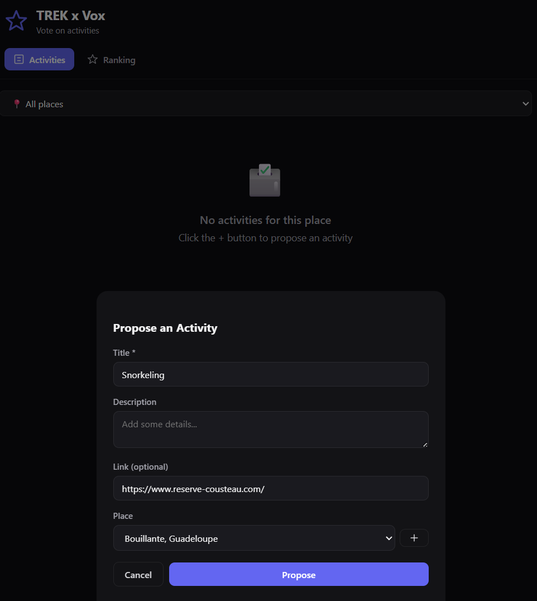
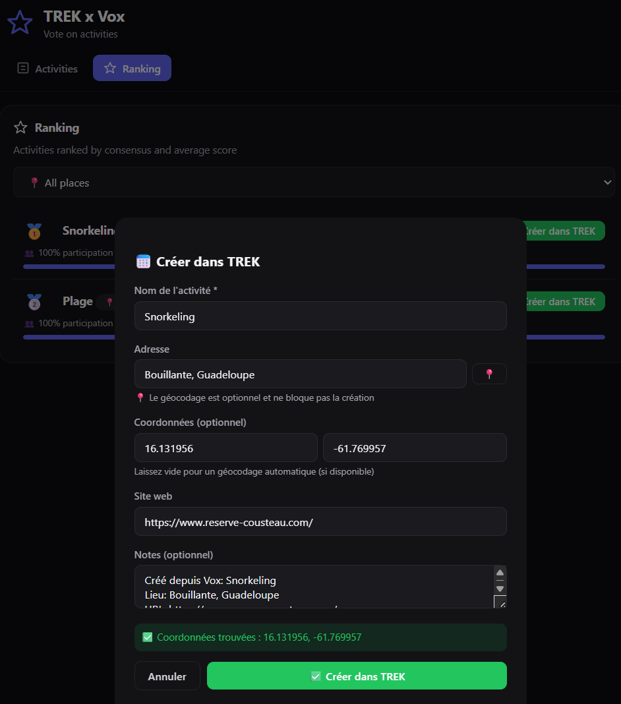
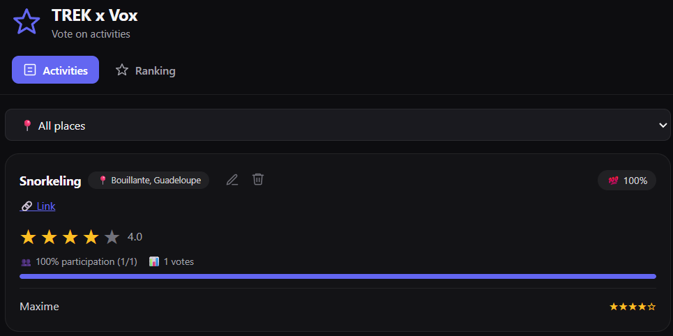
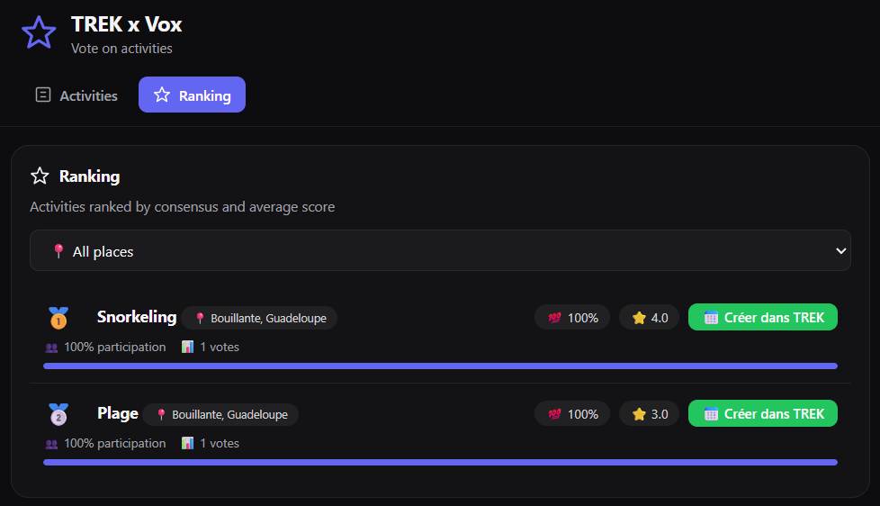
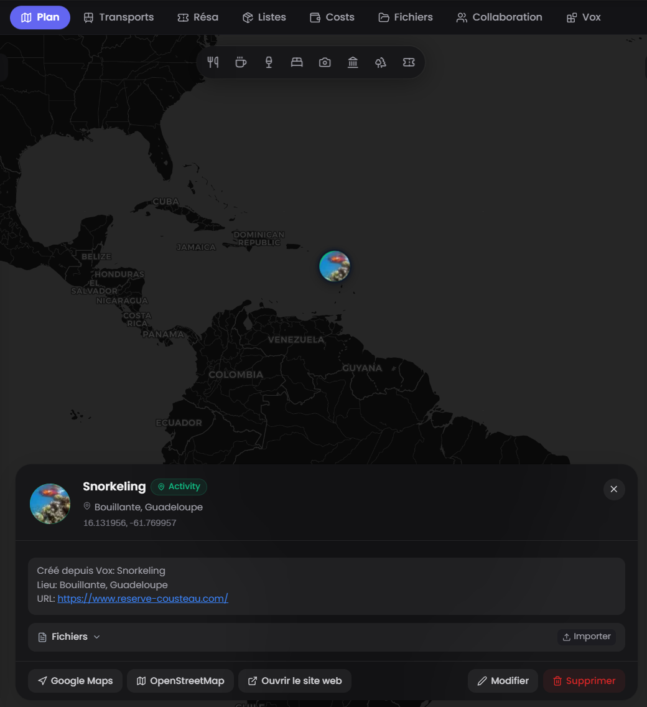
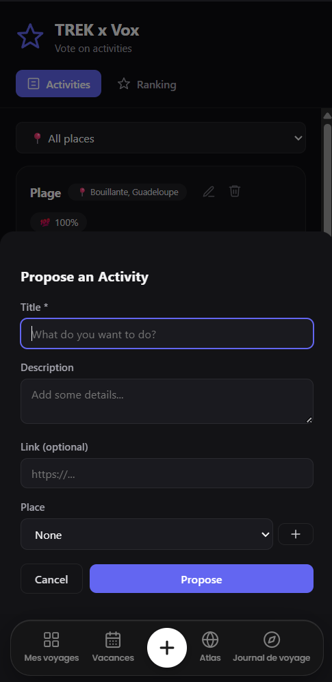
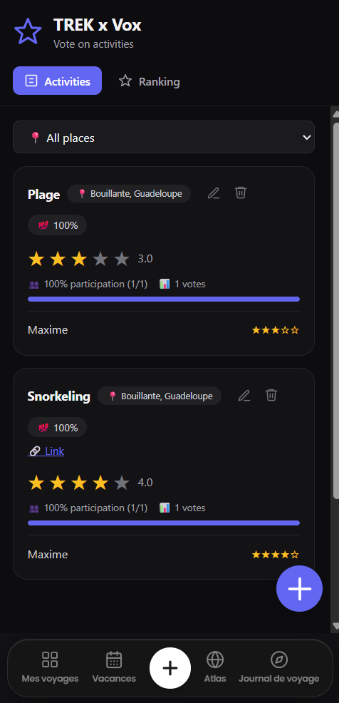
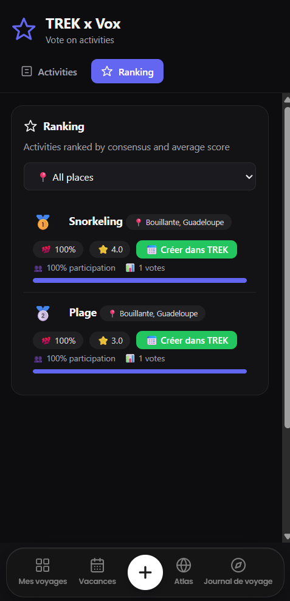
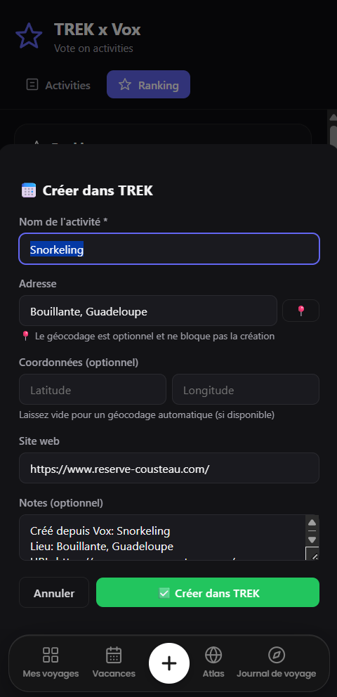

# Vox - Voting Plugin for TREK

**Group decision making for TREK trips.** Vote on activities by location and let the group's collective wisdom guide your travel plans.

## What it does

Vox adds a **voting system** inside any TREK trip, turning group decision-making into a collaborative, democratic process. Activities are proposed for specific locations, and every trip member can vote using a **1-5 star system**. The plugin calculates real-time consensus scores, shows participation rates, and automatically ranks activities to help the group decide.

**Key features:**

- 📍 **Location-based organization** — Activities are grouped by the trip's locations. Members propose activities attached to places, keeping everything contextual and organized.

- ⭐ **1-5 star voting system** — Each member can rate any activity. The scores are averaged to show the group's overall preference, and the star system gives nuanced feedback (not just yes/no).

- 📊 **Real-time metrics** — Every vote updates the consensus score and participation rate instantly. The ranking adapts as votes come in, so the group always knows the top choices.

- 👥 **Voter transparency** — See who has voted and their individual scores. This builds trust and encourages participation, while still allowing private voting if preferred.

- 🏆 **Automatic ranking** — Activities with the highest consensus scores rise to the top. The ranking updates dynamically, so the group can focus on what matters most.

- 📱 **Mobile-first** — The entire interface is responsive and works seamlessly on all devices, from desktop to phone, so voting can happen anywhere.

## Screenshots

### Desktop

**Create an activity** — Propose an activity for a trip location. Fill in the details and submit it for voting.

**Create a TREK activity** — Link your activity directly to a place in TREK, making it part of the trip's itinerary.

**View all activities** — See all proposed activities grouped by location, with their current consensus scores and ranking.

**View ranking** — The ranking view shows the top activities, helping the group decide what to do.

**Result** — See the final decision with full transparency on who voted and how.

### Mobile

**Create activity** — Propose an activity right from your phone while on the go.

**View activities** — Browse all activities and vote from your mobile device.

**View ranking** — Check the ranking and vote on your phone.

**Create TREK place** — Create a TREK place from the voting results directly on mobile.

## Permissions

| Permission | Why it is needed |
|---|---|
| `db:own` | Stores all plugin data in its own private SQLite database: activities, votes, scores, and participation metrics. Everything is scoped per trip. |
| `db:read:trips` | Reads the trip's structure and members to determine who can participate in voting and to show participation metrics per activity. |
| `db:read:users` | Resolves trip members' display names to show who voted for each activity, ensuring transparency and accountability. |
| `db:write:places` | Creates the winning place in TREK from the voting results — the activity with the highest consensus becomes a real place in the trip itinerary. |
| `http:outbound:nominatim.openstreetmap.org` | Geocodes addresses to location data when creating or editing activities. Uses OpenStreetMap's Nominatim service (free, no API key required). |

All permissions are minimal and scoped only to what's needed for the voting functionality. Outbound HTTP is limited to the Nominatim geocoding service.

## Setup

1. Requires **TREK 3.2.0+**. Install Vox from the plugin store (Admin → Plugins → Discover) and activate it, approving the permissions above.
2. Open any **trip** in TREK. Vox will appear as a tab inside that trip, automatically scoped to the trip's context.
3. **Create your first activity** — Click "Add activity" and fill in the details. You can link it to an existing location or create a new one.
4. **Invite members to vote** — Share the trip with your group. Everyone can see the activities and cast their votes.
5. **Watch the ranking evolve** — The consensus score updates in real-time as votes come in. The ranking automatically surfaces the most popular activities.
6. **Create the winner** — When the group reaches a decision, click "Create place in TREK" to turn the winning activity into an actual place in the trip itinerary.

The plugin requires no additional configuration; it works out of the box after installation.

## License

MIT License

Copyright (c) 2024 Maxime Cn

Permission is hereby granted, free of charge, to any person obtaining a copy
of this software and associated documentation files (the "Software"), to deal
in the Software without restriction, including without limitation the rights
to use, copy, modify, merge, publish, distribute, sublicense, and/or sell
copies of the Software, and to permit persons to whom the Software is
furnished to do so, subject to the following conditions:

The above copyright notice and this permission notice shall be included in all
copies or substantial portions of the Software.

THE SOFTWARE IS PROVIDED "AS IS", WITHOUT WARRANTY OF ANY KIND, EXPRESS OR
IMPLIED, INCLUDING BUT NOT LIMITED TO THE WARRANTIES OF MERCHANTABILITY,
FITNESS FOR A PARTICULAR PURPOSE AND NONINFRINGEMENT. IN NO EVENT SHALL THE
AUTHORS OR COPYRIGHT HOLDERS BE LIABLE FOR ANY CLAIM, DAMAGES OR OTHER
LIABILITY, WHETHER IN AN ACTION OF CONTRACT, TORT OR OTHERWISE, ARISING FROM,
OUT OF OR IN CONNECTION WITH THE SOFTWARE OR THE USE OR OTHER DEALINGS IN THE
SOFTWARE.